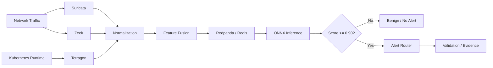

# Cloud-Native IDS + MLOps Research

[](https://github.com/wahdatullah70/cloud-ids-mlops/actions/workflows/ci.yml)
[](LICENSE)

A portfolio/research project for **multi-sensor intrusion detection in cloud-native and HPC-oriented infrastructure**, combining network/runtime security telemetry, stream processing, machine-learning inference, Kubernetes operations, and reproducible validation.

> This is the public engineering companion to the research work. Sensitive infrastructure data, credentials, private datasets, and restricted research evidence are intentionally excluded.

## Architecture



The architecture separates **collection, normalization, streaming, inference, and alerting** so each stage can be operated and troubleshot independently.

## Quick demo

```bash
python3 src/fusion_demo.py examples/events.json
```

The demo reads example Suricata, Zeek, and Tetragon events, creates a fused feature representation, calculates an illustrative probability, applies a configurable threshold, and emits structured JSON.

Compare a deterministic run with [`examples/expected_output.json`](examples/expected_output.json).

> The public demo uses illustrative weights. It is **not** the original trained research model and does not claim to reproduce the documented research metrics.

## Tests and CI

Run locally:

```bash
python -m unittest discover -s tests -v
```

GitHub Actions automatically:

- runs the unit tests;
- executes the public fusion demo;
- validates the generated JSON output.

Tests cover feature-fusion counts, probability bounds, and low-risk behavior for an empty input set.

## End-to-end engineering flow

```text
Sensor telemetry
      │
      ▼
Normalization
      │
      ▼
Feature fusion
      │
      ▼
Streaming / state
      │
      ▼
ONNX model inference
      │
      ▼
Threshold decision
      │
      ▼
Alert routing
      │
      ▼
Controlled validation + evidence
```

Detailed flow: [docs/event-flow.md](docs/event-flow.md)

## Experimental configuration

The documented research experiment used:

- **CIC-IDS2017** and **UNSW-NB15**
- **Logistic Regression**
- **ONNX** deployment format
- **15-dimensional fused feature representation**
- decision threshold **0.90**

### Reported experiment metrics

| Metric | Result |
|---|---:|
| F1 | 0.93 |
| False-positive rate | 0.04 |

These values describe the documented experiment and are not presented as universal production performance.

## Kubernetes deployment model

```text
Suricata / Zeek / Tetragon
           │
           ▼
     Fluent Bit / collection
           │
           ▼
        Redpanda
           │
           ▼
     Stream Processor
        │       │
        ▼       ▼
      Redis   Inference
                 │
                 ▼
            Alert Router
```

Deployment details: [docs/deployment-topology.md](docs/deployment-topology.md)

## Repository structure

```text
cloud-ids-mlops/
├── .github/workflows/ci.yml
├── README.md
├── CONTRIBUTING.md
├── SECURITY.md
├── LICENSE
├── docs/
│   ├── architecture.md
│   ├── event-flow.md
│   ├── deployment-topology.md
│   ├── reproducibility.md
│   ├── security.md
│   └── troubleshooting.md
├── examples/
│   ├── events.json
│   └── expected_output.json
├── tests/
│   └── test_fusion_demo.py
└── src/
    └── fusion_demo.py
```

## Engineering documentation

| Topic | Guide |
|---|---|
| System architecture | [docs/architecture.md](docs/architecture.md) |
| Event + inference flow | [docs/event-flow.md](docs/event-flow.md) |
| Kubernetes topology | [docs/deployment-topology.md](docs/deployment-topology.md) |
| Reproducibility + evidence | [docs/reproducibility.md](docs/reproducibility.md) |
| Security controls | [docs/security.md](docs/security.md) |
| Troubleshooting | [docs/troubleshooting.md](docs/troubleshooting.md) |
| Contribution workflow | [CONTRIBUTING.md](CONTRIBUTING.md) |
| Security policy | [SECURITY.md](SECURITY.md) |

## Reproducibility model

```text
Controlled action
      │
      ▼
Sensor observation
      │
      ▼
Normalized / fused record
      │
      ▼
Inference score
      │
      ▼
Threshold decision
      │
      ▼
Alert + timestamps + evidence
```

Useful artifacts include dataset/version, feature schema, model checksum, threshold, image versions, deployment config, experiment timestamps, and raw/sanitized evidence references.

## Security model

The project documents:

- least-privilege Kubernetes service accounts;
- secret injection rather than committed credentials;
- NetworkPolicies where appropriate;
- controlled access to raw telemetry;
- pinned/versioned model and feature artifacts;
- non-root/minimal container permissions where feasible;
- separation of public synthetic evidence from private research evidence.

## Troubleshooting strategy

```text
Kubernetes health
 → sensor output
 → collection/forwarding
 → Redpanda/streaming
 → feature processing
 → inference
 → alert routing
```

The goal is to identify the **first failed stage** rather than treat the distributed IDS as a single black box.

## Technology areas

`Kubernetes` · `Helm` · `Calico` · `Longhorn` · `Suricata` · `Zeek` · `Tetragon` · `Redpanda` · `Redis` · `Fluent Bit` · `Python` · `ONNX` · `Linux`

## What this project demonstrates

- cloud-native security architecture
- Kubernetes platform operations
- Linux infrastructure
- multi-sensor telemetry handling
- streaming/data pipelines
- feature engineering and model-serving concepts
- ONNX deployment workflow
- automated validation with CI/tests
- controlled validation and evidence collection
- security/reproducibility practices
- incident-style troubleshooting across a distributed pipeline

## Public repository policy

Do not commit API keys, cloud credentials, kubeconfig files, service-account private keys, confidential datasets, sensitive packet captures, or restricted research evidence. Use sanitized examples and runtime secret management for public work.

## Author

**Wahdat Ullah** — Research Assistant, HPC & Cloud Computing

[GitHub Profile](https://github.com/wahdatullah70) · [Engineering Portfolio](https://github.com/wahdatullah70/My_Protfolio)
