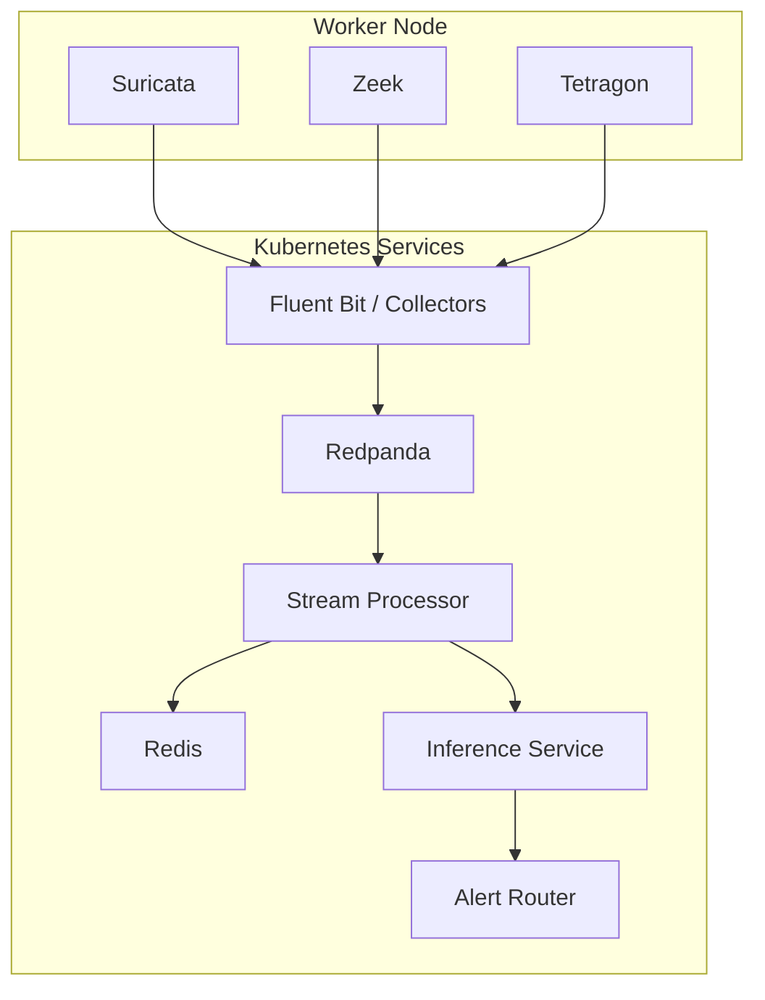

# Deployment Topology

The public architecture is designed around Kubernetes so telemetry collection, streaming, inference, and alerting can be operated as separate services.

## Logical topology



## Operational roles

- **Sensors** collect network/runtime telemetry.
- **Collectors/processors** normalize and route records.
- **Redpanda** provides event-stream decoupling.
- **Redis** can provide low-latency state/cache support.
- **Inference** performs model scoring.
- **Alert Router** handles positive detections and downstream delivery.

## Kubernetes concerns

A production-style deployment should consider:

- namespaces for workload separation;
- requests/limits for predictable scheduling;
- readiness/liveness probes;
- PodDisruptionBudgets where availability matters;
- NetworkPolicies;
- least-privilege service accounts;
- persistent storage only where needed;
- pinned image versions/digests;
- ConfigMaps for non-secret configuration;
- Secrets or an external secret manager for credentials.

## Storage

The broader research environment uses Kubernetes persistent storage where stateful services require it. Public documentation should keep environment-specific storage credentials and private endpoints out of Git.

## Failure isolation

The pipeline should tolerate failures in one component without silently corrupting the rest of the system. Examples:

- sensor outage → mark source unavailable;
- streaming outage → buffer/retry according to policy;
- inference outage → retain records for later processing where feasible;
- malformed event → reject/quarantine instead of crashing the processor.

## Deployment validation

After deployment, validate in layers:

```bash
kubectl get nodes
kubectl get pods -A
kubectl get svc -A
kubectl get pvc -A
```

Then verify the application path in order:

```text
sensor → collector → stream → processor → inference → alert
```

A healthy pod list alone does not prove the end-to-end detection path works.
