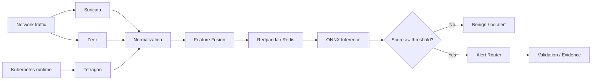

# Event & Inference Flow

This document explains how security telemetry moves through the public architecture.

## End-to-end flow



## 1. Sensor collection

### Suricata
Produces network IDS observations such as alert metadata and flow-level indicators.

### Zeek
Adds connection and protocol context that can complement signature-based observations.

### Tetragon
Adds runtime/container context from the Kubernetes environment.

## 2. Normalization

Each sensor emits a different event shape. Before model inference, events need to be transformed into a predictable internal representation.

A normalization stage should:

- parse timestamps consistently;
- validate required fields;
- map sensor-specific names to canonical names;
- handle missing values explicitly;
- preserve source identity for traceability.

## 3. Feature fusion

The research design uses a compact fused representation rather than sending raw JSON directly to the model.

The public demo in:

```text
src/fusion_demo.py
```

shows the idea using safe synthetic/example events. It is intentionally not the original trained production/research pipeline.

## 4. Streaming / decoupling

Redpanda and Redis can decouple producers from consumers:

```text
Sensors → processing → queue/cache → inference → alerting
```

This makes it easier to scale components independently and to isolate transient downstream failures.

## 5. Inference

The documented research experiment used an ONNX-deployed logistic-regression model with a decision threshold of `0.90`.

Conceptually:

```text
15-D fused vector
      │
      ▼
ONNX model
      │
      ▼
probability score
      │
      ▼
threshold decision
```

The public demonstration code does **not** claim to reproduce the original model score.

## 6. Alert routing

A positive decision can be forwarded to an alert-routing component where additional metadata can be attached for review or validation.

Useful alert context includes:

- event timestamp;
- sensor sources contributing to the fused record;
- model version;
- threshold;
- score;
- workload/pod/node context where available;
- evidence reference.

## 7. Validation evidence

For controlled experiments, record enough information to answer:

- what was injected;
- when it was injected;
- what sensors observed it;
- what fused record was produced;
- when inference occurred;
- whether an alert was emitted;
- how long the end-to-end path took.

This turns a detection claim into an auditable workflow rather than a screenshot or isolated metric.
